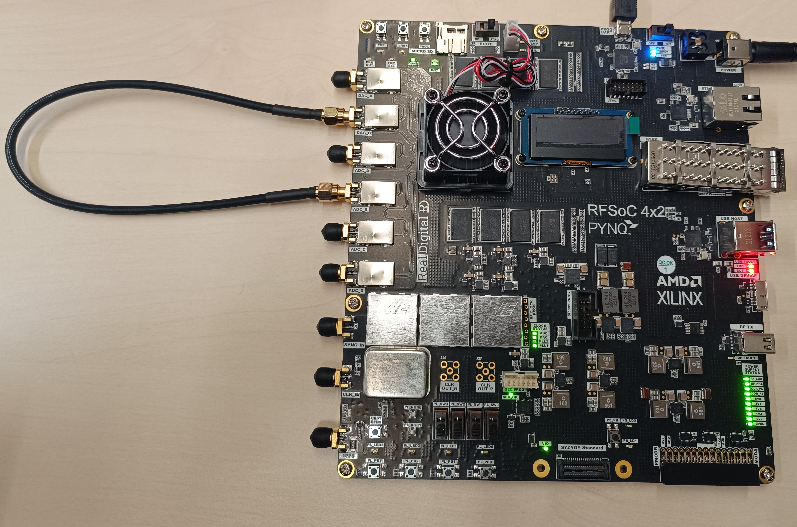
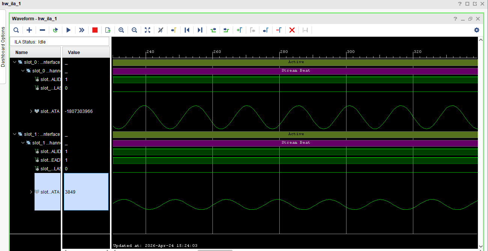
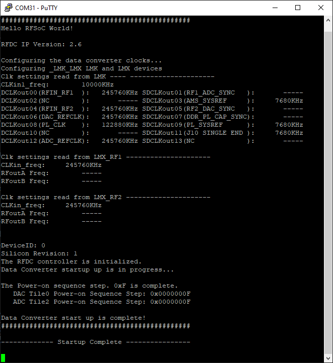
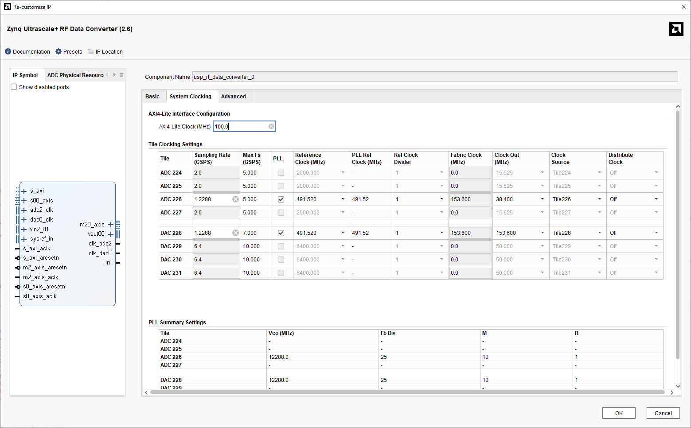

<a id="readme-top"></a>


<!-- TABLE OF CONTENTS -->
<details>
  <summary>Table of Contents</summary>
  <ol>
    <li>
      <a href="#about-the-project">About The Project</a>
      <ul>
        <li><a href="#General-working">General working</a></li>
        <li><a href="#API-for-LMK-and-LMX-configuration">API for LMK and LMX configuration</a></li>
      </ul>
    </li>
    <li>
      <a href="#Built-With">Getting Started</a>
    </li>
    <li>
      <a href="#getting-started">Getting Started</a>
    </li>
    <li><a href="#usage">Usage</a></li>
    <li><a href="#Contributors">Contributors</a></li>
    <li><a href="#license">License</a></li>
    <li><a href="#contact">Contact</a></li>
    <li><a href="#acknowledgments">Acknowledgments</a></li>
  </ol>
</details>
 
# RFSoC 4x2 Loopback example


<!-- ABOUT THE PROJECT -->
## About The Project

This is an example of employing the RFSoC 4x2 board that generate a signal of 10 MHz on the DAC_B; and acquired by the ADC_B to be visualized by means of an ILA.

<p align="center">
  
    
  
</p>

### General working
For proper operation, the LMK4828 and the two LMX25222 devices must be correctly configured. Their register values are generated using TICS Pro software and then programmed via a QSPI connection between the SoC processor and the clock devices using the provided API.

The LMK device is configured to generate a stable 245.76 MHz clock, which serves as the input reference for the LMX devices. The LMX25222 devices are then configured to generate 491.52 MHz clocks.

These clocks drive the RFSoC subsystem, which must be configured in the RF Data Converter IP within Vivado. In this configuration, the reference clock is set to 491.52 MHz. The ADC is configured with an output clock of 38.4 MHz, while the DAC is configured with an output clock of 153.6 MHz.

<p align="center">
  
</p>

The DAC clock also feeds a DDS Compiler IP, which generates a 10 MHz sinusoidal signal. This signal is provided as AXI-Stream (AXIS) input data to the DAC.


### API for LMK and LMX configuration
The project provides the API for the XRFclk middleware to control the LMK and LMX devices via QSPI with the SoC processor. It is derived from xrfclk.c, an API originally provided by Xilinx, which uses an I2C connection between the processor and an SPI bridge connected to the clock devices, for the ZCU111 and ZCU208 boards.

A key difference between the ZCU111/ZCU208 boards and the RFSoC 4x2 are the next:
- RFSoC 4x2 requires low-level control of the LMK reset and LMK clock select inputs via GPIO (MIO7, MIO8, MIO12) (see ReferenceManual_A6_rfsoc42.pdf, p. 24; schematic_rfsoc42.pdf, p. 16).This is not explicit explained in the Reference manual of the RFSoC board.

- RFSoC 4x2 required for Reading back the LMK clock registers, to write to register 0x16E, setting the SPI readback bit to 1. This disables the pin as an output and configures it as an input, which is connected to the SPI SDO pin (see schematic_rfsoc42.pdf, p. 16; lmk4828.pdf, p. 79).

<p align="right">(<a href="#readme-top">back to top</a>)</p>

## Built With

### Software

* [Vivado 2023.2][Vivado2023.2]
* [Vitis Classic 2023.2][Vivado2023.2]
* [Tics Pro][TICsPRO]

### Hardware
* [RFSoC 4x2][rfsoc4x2]

<p align="right">(<a href="#readme-top">back to top</a>)</p>

<!-- GETTING STARTED -->
## Getting Started

1. Clone the repo
   ```sh
   git clone https://github.com/agrequejo/rfsoc4x2_loopback.git
   ```
2. Open vivado and go to the path you have downloaded the project in the tcl console and run:
    ```sh
    source hw.tcl
    ```
    This will create the vivado proyect, make synthesis and implementation on the hw folder.

3. To run the provided bare-metal software application:
    <!-- - Generate the bitstream for the project in Vivado. -->
    <!-- - Export the hardware, including the bitstream, to the sq folder. -->
    - Open Vitis Classic and set the workspace to the sw folder.
    - Create a platform project by selecting the exported .xsa file, found in the src folder.
    - Create an application project based on the created platform.
    - Add the provided source files located in the src folder within the sw directory to the application project.

<p align="right">(<a href="#readme-top">back to top</a>)</p>


## Contributors:
A. García-Requejo &
A. Hernández \
Geintra Research Group. Electronics Department, University of Alcalá

<p align="right">(<a href="#readme-top">back to top</a>)</p>


<!-- LICENSE -->
## License

Distributed under the MIT License. See `LICENSE.txt` for more information.

<p align="right">(<a href="#readme-top">back to top</a>)</p>


<!-- CONTACT -->
## Contact

<p align="right">(<a href="#readme-top">back to top</a>)</p>


<!-- ACKNOWLEDGMENTS -->
## Acknowledgments

This example project could be solved thanks to:

* [zuyuan_xing] (https://discuss.pynq.io/t/program-lmk-lmx-on-rfsoc4x2-from-vitis-no-pynq/8383/14)
* [Gallicchio] (https://github.com/gallicchio/RFSoC4x2play)

<p align="right">(<a href="#readme-top">back to top</a>)</p>


[Vivado2023.2]: https://www.xilinx.com/support/download/index.html/content/xilinx/en/downloadNav/vivado-design-tools/archive.html
[TICsPRO]: https://www.ti.com/tool/es-mx/TICSPRO-SW
[rfsoc4x2]: https://www.realdigital.org/hardware/rfsoc-4x2


